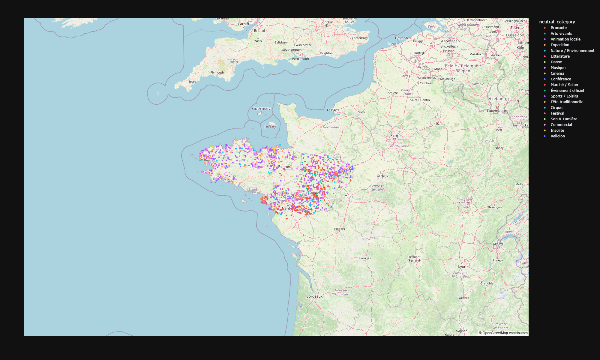

# Data4People

**Data4People** est un projet dédié à la valorisation des données publiques : collecte, exploration, analyse et création de visualisations accessibles à tous.

## 🎯 Objectifs du projet

* Faciliter l'accès et la compréhension des données ouvertes.
* Proposer des explorations reproductibles et transparentes.
* Générer des visualisations interactives (cartes, graphiques, tableaux).
* Mettre en avant des usages concrets pour les citoyens, associations, collectivités ou journalistes.

## 📂 Structure du projet

* `data/` : jeux de données bruts, nettoyés et enrichis.
* `exploration/` : notebooks Jupyter pour l'analyse exploratoire.
* `pipeline/` : scripts Python pour automatiser les traitements.
* `export_html/` : visualisations, cartes interactives, exports.

## Exemple: Carte de l'ensemble des événements des Pays-de-la-Loire / Loire-Atlantique / Nantes / Bretagne

.

<iframe src="./export_html/carte_interactive_evenements.html" width="100%" height="700px"></iframe>

<u>**Source des données:**</u>

**Région Bretagne & Pays-de-la-Loire - Données originales téléchargées sur les sites ci-dessous, mise à jour du 19 Novembre 2025**

<u>Pour les Pays-de-la-Loire:</u>
* https://data.nantesmetropole.fr/explore/dataset/234400034_070-002_offre-touristique-fetes_et_manifestations-rpdl%40paysdelaloire/table/?disjunctive.commune
* https://data.loire-atlantique.fr/explore/dataset/793866443_hotelleries-de-plein-air-camping-en-loire-atlantique/export/?disjunctive.categorie&disjunctive.commune&location=10,47.38948,-1.78213&basemap=jawg.streets
* https://data.loire-atlantique.fr/explore/dataset/793866443_hebergements-collectifs-touristiques-en-loire-atlantique/table/

<u>Pour la Bretagne:</u>
* https://data.bretagne.bzh/explore/dataset/bretagne-fetes-et-manifestations/export/

## 🛠️ Technologies utilisées

* **Python** (Polars, Pandas, Plotly, GeoPandas...)
* **Jupyter Notebooks**
* **Plotly / Mapbox** pour les cartes interactives
* **Open Data** (source : données publiques locales, nationales ou européennes)

### 🐍 Installation classique avec venv
```bash
# Cloner le projet
git clone https://github.com/votrecompte/data4people.git
cd data4people

# Créer un environnement virtuel
python -m venv .venv

# Activer l'environnement
# Windows
.venv\Scripts\activate
# macOS / Linux
source .venv/bin/activate

# Installer les dépendances
pip install -r requirements.txt
```

### 💡 Option : utilisation avec PyCharm
1. Ouvrir le dossier du projet dans PyCharm
2. Aller dans *Settings > Project > Python Interpreter*
3. Créer un nouvel interpréteur basé sur `.venv`
4. PyCharm installera automatiquement les dépendances à partir de `requirements.txt`

### 📓 Option : installer JupyterLab / Notebook
```bash
pip install jupyterlab
jupyter lab
```
Les notebooks du dossier `notebooks/` seront alors accessibles.

## 🚀 Fonctionnalités principales

* Chargement et nettoyage de données hétérogènes.
* Géocodage, gestion des coordonnées et visualisation cartographique.
* Explorations thématiques (culture, mobilité, environnement, événements...).
* Export web de cartes interactives (HTML autonome).

## 📊 Exemple : Carte interactive des événements

Le projet inclut une carte dynamique basée sur OpenStreetMap affichant des événements régionaux. Elle est générée avec Plotly et exportable en HTML pour intégration sur un site web.

## 📢 Public visé

* Collectivités et décideurs publics.
* Citoyens curieux d'explorer les données de leur territoire.
* Étudiants, chercheurs, journalistes.

## 🤝 Contributions

Les contributions sont les bienvenues : ajout de données, propositions de visualisations, corrections ou documentation.

## 📜 Licence

Les données utilisées dépendent des licences des sources.

---

*Data4People : rendre des données publiques… utiles, compréhensibles et vivantes.*
